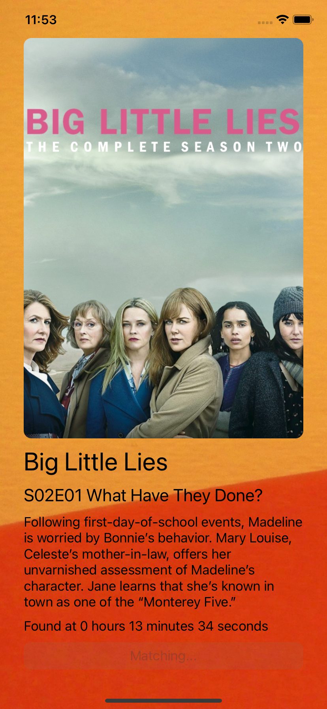
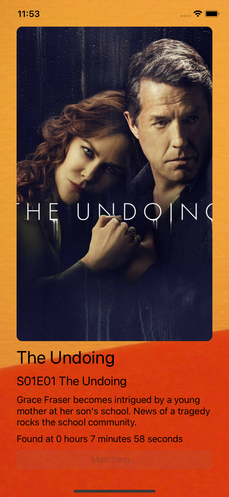
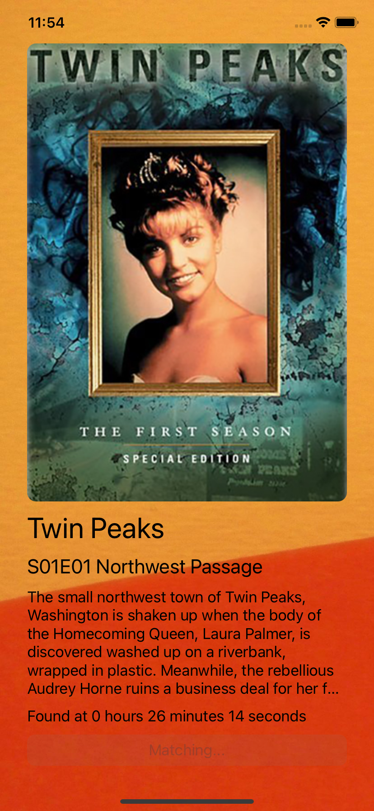
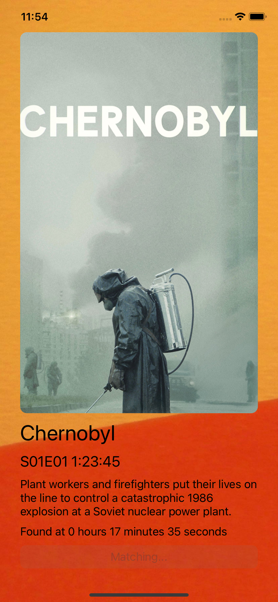

# TVid
**Requires iOS 15.0+**

 &nbsp;  &nbsp;  &nbsp; 

TVid showcases the new ShazamKit API available in iOS 15 by providing custom signatures and building a custom catalog to match against.
* Built in Swift with no external dependencies.
* No data is collected.
* The app works like a Shazam for TV shows, recognizing show, episode number, and providing the time stamp of the recognized bit.
* Signatures are built in and custom metadata is provided as well, so recognition is possible offline, while poster art is downloaded on the fly from TMBd.

